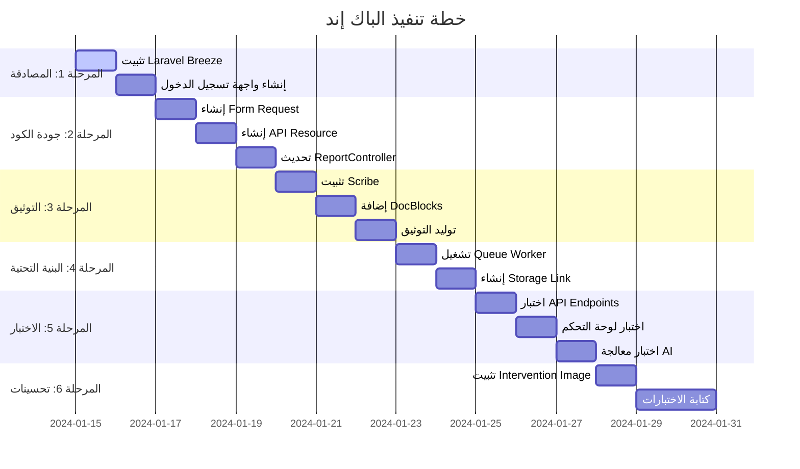

# خطة تنفيذ الباك إند - Smart Damage Assessment System

## نظرة عامة

هذه الخطة تغطي المهام المتبقية لإكمال الباك إند بناءً على المهمة الأصلية ومعايير الكود في [`AGENTS.md`](AGENTS.md).

---

## حالة المشروع الحالية

### ✅ ما تم إنجازه

| المكون                    | الحالة   | الملف                                                                                                                                                                                                                                                                                                        |
| ------------------------- | -------- | ------------------------------------------------------------------------------------------------------------------------------------------------------------------------------------------------------------------------------------------------------------------------------------------------------------ |
| Database Migrations       | ✅ مكتمل | [`backend/database/migrations/2024_01_01_000001_create_users_and_reports_tables.php`](backend/database/migrations/2024_01_01_000001_create_users_and_reports_tables.php)                                                                                                                                     |
| Models (User, Report)     | ✅ مكتمل | [`backend/app/Models/User.php`](backend/app/Models/User.php), [`backend/app/Models/Report.php`](backend/app/Models/Report.php)                                                                                                                                                                               |
| API Controllers           | ✅ مكتمل | [`backend/app/Http/Controllers/Api/AuthController.php`](backend/app/Http/Controllers/Api/AuthController.php), [`backend/app/Http/Controllers/Api/ReportController.php`](backend/app/Http/Controllers/Api/ReportController.php)                                                                               |
| Admin Controller          | ✅ مكتمل | [`backend/app/Http/Controllers/Admin/DashboardController.php`](backend/app/Http/Controllers/Admin/DashboardController.php)                                                                                                                                                                                   |
| AI Job (AnalyzeDamageJob) | ✅ مكتمل | [`backend/app/Jobs/AnalyzeDamageJob.php`](backend/app/Jobs/AnalyzeDamageJob.php)                                                                                                                                                                                                                             |
| GeminiService             | ✅ مكتمل | [`backend/app/Services/GeminiService.php`](backend/app/Services/GeminiService.php)                                                                                                                                                                                                                           |
| API Routes                | ✅ مكتمل | [`backend/routes/api.php`](backend/routes/api.php)                                                                                                                                                                                                                                                           |
| Web Routes                | ✅ مكتمل | [`backend/routes/web.php`](backend/routes/web.php), [`backend/routes/auth.php`](backend/routes/auth.php)                                                                                                                                                                                                     |
| Admin Views               | ✅ مكتمل | [`backend/resources/views/admin/dashboard.blade.php`](backend/resources/views/admin/dashboard.blade.php), [`backend/resources/views/admin/map.blade.php`](backend/resources/views/admin/map.blade.php), [`backend/resources/views/admin/reports.blade.php`](backend/resources/views/admin/reports.blade.php) |
| UserSeeder                | ✅ مكتمل | [`backend/database/seeders/UserSeeder.php`](backend/database/seeders/UserSeeder.php)                                                                                                                                                                                                                         |
| Laravel Sanctum           | ✅ مثبت  | [`backend/composer.json`](backend/composer.json:11)                                                                                                                                                                                                                                                          |
| Guzzle HTTP               | ✅ مثبت  | [`backend/composer.json`](backend/composer.json:9)                                                                                                                                                                                                                                                           |

### ❌ ما لم يتم إنجازه

| المكون                     | الحالة            | الأولوية |
| -------------------------- | ----------------- | -------- |
| Laravel Breeze             | ❌ غير مثبت       | عالية    |
| Form Requests (Validation) | ❌ غير موجود      | عالية    |
| API Resources              | ❌ غير موجود      | عالية    |
| Scribe (API Documentation) | ❌ غير مثبت       | متوسطة   |
| Intervention Image         | ❌ غير مثبت       | متوسطة   |
| Tests (Feature/Unit)       | ❌ غير موجود      | متوسطة   |
| Queue Worker Setup         | ❌ لم يتم الإعداد | عالية    |
| Storage Link               | ❌ لم يتم الإعداد | عالية    |

---

## المهام المتبقية

### المرحلة 1: إكمال المصادقة (Authentication)

#### المهمة 1.1: تثبيت Laravel Breeze

**الهدف:** تثبيت Breeze لواجهة تسجيل دخول الأدمن كما هو مطلوب في المهمة الأصلية.

**الأوامر:**

```bash
cd backend
composer require laravel/breeze --dev
php artisan breeze:install blade
npm install
npm run dev
```

**الملفات المتأثرة:**

- [`backend/composer.json`](backend/composer.json) - إضافة laravel/breeze
- [`backend/routes/auth.php`](backend/routes/auth.php) - سيتم استبدالها بـ routes من Breeze
- [`backend/app/Http/Controllers/Auth/AuthController.php`](backend/app/Http/Controllers/Auth/AuthController.php) - قد يتم استبدالها

**النتيجة المتوقعة:**

- واجهات تسجيل دخول جاهزة (login, register)
- حماية المسارات بـ middleware
- إعادة تعيين كلمة المرور

---

#### المهمة 1.2: إنشاء واجهة تسجيل الدخول المخصصة (اختياري)

**الهدف:** إذا لم يتم استخدام Breeze، إنشاء [`backend/resources/views/auth/login.blade.php`](backend/resources/views/auth/login.blade.php).

**الخطوات:**

1. إنشاء مجلد `backend/resources/views/auth/`
2. إنشاء ملف `login.blade.php` مع نموذج تسجيل الدخول
3. إضافة تنسيق CSS (Tailwind أو Bootstrap)

**النتيجة المتوقعة:**

- واجهة تسجيل دخول تعمل مع [`AuthController.php`](backend/app/Http/Controllers/Auth/AuthController.php)

---

### المرحلة 2: تحسين جودة الكود (Code Quality)

#### المهمة 2.1: إنشاء Form Request للتحقق من صحة البيانات

**الهدف:** إنشاء [`backend/app/Http/Requests/StoreReportRequest.php`](backend/app/Http/Requests/StoreReportRequest.php) لفصل منطق التحقق من الـ Controller.

**الأمر:**

```bash
php artisan make:request StoreReportRequest
```

**محتوى الملف:**

```php
<?php

namespace App\Http\Requests;

use Illuminate\Foundation\Http\FormRequest;
use Illuminate\Contracts\Validation\Validator;
use Illuminate\Http\Exceptions\HttpResponseException;

class StoreReportRequest extends FormRequest
{
    public function authorize(): bool
    {
        return true;
    }

    public function rules(): array
    {
        return [
            'image' => 'required|image|max:10240',
            'latitude' => 'required|numeric|between:-90,90',
            'longitude' => 'required|numeric|between:-180,180',
            'raw_location' => 'required|string|max:255',
            'raw_description' => 'nullable|string|max:2000',
        ];
    }

    public function messages(): array
    {
        return [
            'image.required' => 'The image field is required.',
            'image.image' => 'The file must be an image.',
            'image.max' => 'The image may not be greater than 10MB.',
            'latitude.required' => 'The latitude field is required.',
            'latitude.numeric' => 'The latitude must be a number.',
            'latitude.between' => 'The latitude must be between -90 and 90.',
            'longitude.required' => 'The longitude field is required.',
            'longitude.numeric' => 'The longitude must be a number.',
            'longitude.between' => 'The longitude must be between -180 and 180.',
            'raw_location.required' => 'The location field is required.',
            'raw_location.max' => 'The location may not be greater than 255 characters.',
            'raw_description.max' => 'The description may not be greater than 2000 characters.',
        ];
    }

    protected function failedValidation(Validator $validator)
    {
        throw new HttpResponseException(
            response()->json([
                'errors' => $validator->errors()
            ], 422)
        );
    }
}
```

**الملفات المتأثرة:**

- جديد: [`backend/app/Http/Requests/StoreReportRequest.php`](backend/app/Http/Requests/StoreReportRequest.php)
- سيتم تحديث: [`backend/app/Http/Controllers/Api/ReportController.php`](backend/app/Http/Controllers/Api/ReportController.php)

---

#### المهمة 2.2: إنشاء API Resource

**الهدف:** إنشاء [`backend/app/Http/Resources/ReportResource.php`](backend/app/Http/Resources/ReportResource.php) لتحويل البيانات إلى JSON بشكل موحد.

**الأمر:**

```bash
php artisan make:resource ReportResource
```

**محتوى الملف:**

```php
<?php

namespace App\Http\Resources;

use Illuminate\Http\Request;
use Illuminate\Http\Resources\Json\JsonResource;

class ReportResource extends JsonResource
{
    /**
     * Transform the resource into an array.
     *
     * @return array<string, mixed>
     */
    public function toArray(Request $request): array
    {
        return [
            'id' => $this->id,
            'user' => [
                'id' => $this->user->id,
                'name' => $this->user->name,
            ],
            'image_url' => url('storage/' . $this->image_path),
            'location' => [
                'raw' => $this->raw_location,
                'normalized' => $this->ai_location ?? $this->raw_location,
                'coordinates' => [
                    'latitude' => (float) $this->latitude,
                    'longitude' => (float) $this->longitude,
                ],
            ],
            'description' => [
                'raw' => $this->raw_description,
                'ai_analysis' => $this->ai_analysis,
            ],
            'damage_assessment' => [
                'level' => $this->ai_damage_level,
                'status' => $this->status,
            ],
            'created_at' => $this->created_at->format('Y-m-d H:i:s'),
            'updated_at' => $this->updated_at->format('Y-m-d H:i:s'),
        ];
    }
}
```

**الملفات المتأثرة:**

- جديد: [`backend/app/Http/Resources/ReportResource.php`](backend/app/Http/Resources/ReportResource.php)
- سيتم تحديث: [`backend/app/Http/Controllers/Api/ReportController.php`](backend/app/Http/Controllers/Api/ReportController.php)

---

#### المهمة 2.3: تحديث ReportController

**الهدف:** تحديث [`backend/app/Http/Controllers/Api/ReportController.php`](backend/app/Http/Controllers/Api/ReportController.php) لاستخدام Form Request و API Resource.

**التعديلات المطلوبة:**

1. استيراد `StoreReportRequest` و `ReportResource`
2. تحديث دالة `store()` لاستخدام `StoreReportRequest`
3. تحديث دالة `index()` لاستخدام `ReportResource::collection()`
4. تحديث دالة `show()` لاستخدام `ReportResource::make()`
5. إضافة DocBlocks للتوثيق

**الكود المحدث:**

```php
<?php

namespace App\Http\Controllers\Api;

use App\Http\Controllers\Controller;
use App\Http\Requests\StoreReportRequest;
use App\Http\Resources\ReportResource;
use App\Jobs\AnalyzeDamageJob;
use App\Models\Report;
use Illuminate\Http\Request;

/**
 * @group Report Management
 *
 * APIs for managing damage reports
 */
class ReportController extends Controller
{
    /**
     * Get all reports for the authenticated user.
     *
     * @authenticated
     * @response 200 {
     *   "data": [
     *     {
     *       "id": 1,
     *       "user": {"id": 1, "name": "User"},
     *       "image_url": "http://...",
     *       "location": {...},
     *       "description": {...},
     *       "damage_assessment": {...}
     *     }
     *   ]
     * }
     */
    public function index(): \Illuminate\Http\JsonResponse
    {
        $reports = auth()->user()->reports()->latest()->get();
        return response()->json(ReportResource::collection($reports));
    }

    /**
     * Create a new damage report.
     *
     * @authenticated
     * @bodyParam image file required The damage image. Maximum size: 10MB.
     * @bodyParam latitude number required The GPS latitude. Example: 36.2018
     * @bodyParam longitude number required The GPS longitude. Example: 37.1342
     * @bodyParam raw_location string required The location name as entered by user. Example: "حلب السكري"
     * @bodyParam raw_description string optional Additional description. Maximum: 2000 characters.
     * @response 201 {
     *   "data": {
     *     "id": 1,
     *     "status": "pending",
     *     "message": "Report submitted successfully. Processing will start shortly."
     *   }
     * }
     * @response 422 {
     *   "errors": {
     *     "image": ["The image field is required."]
     *   }
     * }
     */
    public function store(StoreReportRequest $request): \Illuminate\Http\JsonResponse
    {
        $imagePath = $request->file('image')->store('reports', 'public');

        $report = Report::create([
            'user_id' => auth()->id(),
            'image_path' => $imagePath,
            'latitude' => $request->latitude,
            'longitude' => $request->longitude,
            'raw_location' => $request->raw_location,
            'raw_description' => $request->raw_description ?? '',
            'status' => 'pending',
        ]);

        AnalyzeDamageJob::dispatch($report->id);

        return response()->json([
            'data' => [
                'id' => $report->id,
                'status' => 'pending',
                'message' => 'Report submitted successfully. Processing will start shortly.'
            ]
        ], 201);
    }

    /**
     * Get a specific report.
     *
     * @authenticated
     * @urlParam id required The report ID.
     * @response 200 {
     *   "data": {
     *     "id": 1,
     *     "user": {...},
     *     "image_url": "http://...",
     *     ...
     *   }
     * }
     * @response 404 {"message": "Report not found"}
     */
    public function show(int $id): \Illuminate\Http\JsonResponse
    {
        $report = auth()->user()->reports()->findOrFail($id);
        return response()->json(ReportResource::make($report));
    }
}
```

---

### المرحلة 3: توثيق API (API Documentation)

#### المهمة 3.1: تثبيت Scribe

**الهدف:** تثبيت حزمة Scribe لتوثيق API تلقائياً.

**الأوامر:**

```bash
cd backend
composer require --dev knuckleswtf/scribe
php artisan vendor:publish --tag=scribe-config
```

**الملفات المتأثرة:**

- [`backend/composer.json`](backend/composer.json) - إضافة knuckleswtf/scribe
- جديد: `backend/config/scribe.php`

---

#### المهمة 3.2: إضافة DocBlocks

**الهدف:** إضافة DocBlocks لجميع دوال الـ Controllers لتظهر في التوثيق.

**الملفات المطلوب تحديثها:**

- [`backend/app/Http/Controllers/Api/AuthController.php`](backend/app/Http/Controllers/Api/AuthController.php)
- [`backend/app/Http/Controllers/Api/ReportController.php`](backend/app/Http/Controllers/Api/ReportController.php)

**مثال DocBlock:**

```php
/**
 * @group Authentication
 *
 * APIs for user authentication
 */
class AuthController extends Controller
{
    /**
     * Login user and return API token.
     *
     * @bodyParam email string required The user email. Example: admin@test.com
     * @bodyParam password string required The user password. Example: password
     * @response 200 {
     *   "token": "1|xyz...",
     *   "user": {
     *     "id": 1,
     *     "name": "Admin User",
     *     "email": "admin@test.com",
     *     "role": "admin"
     *   }
     * }
     * @response 401 {"error": "Invalid credentials"}
     */
    public function login(Request $request) { ... }
```

---

#### المهمة 3.3: توليد التوثيق

**الهدف:** توليد صفحة HTML للتوثيق.

**الأمر:**

```bash
php artisan scribe:generate
```

**النتيجة:**

- ملفات التوثيق في `backend/public/docs/`
- الوصول عبر: `http://localhost:8000/docs`

---

### المرحلة 4: إعداد البنية التحتية (Infrastructure Setup)

#### المهمة 4.1: تشغيل Queue Worker

**الهدف:** تشغيل Queue Worker لمعالجة الـ Jobs في الخلفية.

**الأمر (للتطوير):**

```bash
# في نافذة طرفية منفصلة
cd backend
php artisan queue:work
```

**أو استخدام Supervisor للإنتاج:**

```ini
[program:laravel-queue-worker]
process_name=%(program_name)s_%(process_num)02d
command=php /var/www/html/backend/artisan queue:work --sleep=3 --tries=3
autostart=true
autorestart=true
user=www-data
numprocs=2
redirect_stderr=true
stdout_logfile=/var/www/html/backend/storage/logs/queue-worker.log
```

---

#### المهمة 4.2: إنشاء Storage Link

**الهدف:** إنشاء رابط رمزي للوصول للصور المخزنة.

**الأمر:**

```bash
cd backend
php artisan storage:link
```

**النتيجة:**

- رابط رمزي من `backend/public/storage` إلى `backend/storage/app/public`
- الوصول للصور عبر: `http://localhost:8000/storage/reports/image.jpg`

---

### المرحلة 5: الاختبار (Testing)

#### المهمة 5.1: اختبار API Endpoints

**الهدف:** اختبار جميع endpoints باستخدام Postman أو curl.

**الاختبارات المطلوبة:**

1. **تسجيل الدخول:**

```bash
curl -X POST http://localhost:8000/api/login \
  -H "Content-Type: application/json" \
  -d '{"email":"admin@test.com","password":"password"}'
```

2. **رفع تقرير:**

```bash
curl -X POST http://localhost:8000/api/reports \
  -H "Authorization: Bearer YOUR_TOKEN" \
  -F "image=@/path/to/image.jpg" \
  -F "latitude=36.2018" \
  -F "longitude=37.1342" \
  -F "raw_location=حلب السكري" \
  -F "raw_description=تضرر المبنى بشكل جزئي"
```

3. **جلب التقارير:**

```bash
curl -X GET http://localhost:8000/api/reports \
  -H "Authorization: Bearer YOUR_TOKEN"
```

4. **جلب تقرير محدد:**

```bash
curl -X GET http://localhost:8000/api/reports/1 \
  -H "Authorization: Bearer YOUR_TOKEN"
```

---

#### المهمة 5.2: اختبار لوحة التحكم

**الهدف:** اختبار جميع صفحات لوحة التحكم.

**الاختبارات المطلوبة:**

1. تسجيل الدخول كـ Admin
2. عرض Dashboard
3. عرض الخريطة
4. عرض جدول التقارير
5. التحقق من عمل Chart.js

---

#### المهمة 5.3: اختبار معالجة AI

**الهدف:** التأكد من أن Jobs تعمل بشكل صحيح.

**الاختبارات المطلوبة:**

1. رفع تقرير جديد
2. التحقق من تغيير الحالة: pending → processing → completed
3. التحقق من وجود بيانات AI (ai_location, ai_damage_level, ai_analysis)
4. التحقق من Logs في `backend/storage/logs/laravel.log`

---

### المرحلة 6: التحسينات الإضافية (Optional Improvements)

#### المهمة 6.1: تثبيت Intervention Image

**الهدف:** ضغط الصور قبل الرفع لتوفير المساحة.

**الأمر:**

```bash
cd backend
composer require intervention/image
```

**الاستخدام في ReportController:**

```php
use Intervention\Image\Facades\Image;

$image = Image::make($request->file('image'));
$image->resize(1920, null, function ($constraint) {
    $constraint->aspectRatio();
    $constraint->upsize();
});
$imagePath = $request->file('image')->store('reports', 'public');
```

---

#### المهمة 6.2: كتابة الاختبارات

**الهدف:** كتابة Feature و Unit Tests.

**الأوامر:**

```bash
php artisan make:test ReportApiTest
php artisan make:test AuthApiTest
php artisan make:test AnalyzeDamageJobTest
```

---

## مخطط التسلسل الزمني



---

## ملخص المهام

| #   | المهمة                   | الأولوية | المدة المتوقعة | الملفات                                                                                                                                                                                                                        |
| --- | ------------------------ | -------- | -------------- | ------------------------------------------------------------------------------------------------------------------------------------------------------------------------------------------------------------------------------ |
| 1   | تثبيت Laravel Breeze     | عالية    | يوم            | [`backend/composer.json`](backend/composer.json)                                                                                                                                                                               |
| 2   | إنشاء Form Request       | عالية    | يوم            | [`backend/app/Http/Requests/StoreReportRequest.php`](backend/app/Http/Requests/StoreReportRequest.php)                                                                                                                         |
| 3   | إنشاء API Resource       | عالية    | يوم            | [`backend/app/Http/Resources/ReportResource.php`](backend/app/Http/Resources/ReportResource.php)                                                                                                                               |
| 4   | تحديث ReportController   | عالية    | يوم            | [`backend/app/Http/Controllers/Api/ReportController.php`](backend/app/Http/Controllers/Api/ReportController.php)                                                                                                               |
| 5   | تثبيت Scribe             | متوسطة   | يوم            | [`backend/composer.json`](backend/composer.json)                                                                                                                                                                               |
| 6   | إضافة DocBlocks          | متوسطة   | يوم            | [`backend/app/Http/Controllers/Api/AuthController.php`](backend/app/Http/Controllers/Api/AuthController.php), [`backend/app/Http/Controllers/Api/ReportController.php`](backend/app/Http/Controllers/Api/ReportController.php) |
| 7   | تشغيل Queue Worker       | عالية    | يوم            | -                                                                                                                                                                                                                              |
| 8   | إنشاء Storage Link       | عالية    | يوم            | -                                                                                                                                                                                                                              |
| 9   | اختبار النظام            | عالية    | 3 أيام         | -                                                                                                                                                                                                                              |
| 10  | تثبيت Intervention Image | منخفضة   | يوم            | [`backend/composer.json`](backend/composer.json)                                                                                                                                                                               |
| 11  | كتابة الاختبارات         | متوسطة   | يومين          | [`backend/tests/Feature/`](backend/tests/Feature/), [`backend/tests/Unit/`](backend/tests/Unit/)                                                                                                                               |

---

## المتطلبات الأساسية

قبل البدء، تأكد من:

1. ✅ Laravel 11 مثبت
2. ✅ MySQL قاعدة بيانات مُعدة
3. ✅ Google Gemini API Key متوفر
4. ✅ Node.js و npm مثبتين (لـ Breeze)

---

## الخطوات السريعة للبدء

```bash
# 1. الانتقال لمجلد الباك إند
cd backend

# 2. تثبيت المكتبات
composer install
npm install

# 3. إعداد البيئة
cp .env.example .env
php artisan key:generate

# 4. تشغيل الترحيلات
php artisan migrate:fresh --seed

# 5. إنشاء رابط التخزين
php artisan storage:link

# 6. تشغيل Queue Worker (في نافذة منفصلة)
php artisan queue:work

# 7. تشغيل السيرفر
php artisan serve
```

---

## ملاحظات هامة

1. **Queue Worker:** يجب تشغيله دائماً لمعالجة الـ AI Jobs
2. **Storage Link:** ضروري للوصول للصور المرفوعة
3. **Gemini API Key:** أضفه إلى `.env` كـ `GEMINI_API_KEY=your_key_here`
4. **Breeze:** إذا تم تثبيته، سيتم استبدال [`AuthController.php`](backend/app/Http/Controllers/Auth/AuthController.php) المخصص
5. **Scribe:** يعمل فقط في بيئة التطوير (local) افتراضياً

---

## المراجع

- [`AGENTS.md`](AGENTS.md) - معايير الكود
- [`README.md`](README.md) - نظرة عامة على المشروع
- [`Documentation.md`](Documentation.md) - مهام التوثيق
- [`backend/LARAVEL_BACKEND_SUMMARY.md`](backend/LARAVEL_BACKEND_SUMMARY.md) - ملخص الباك إند
