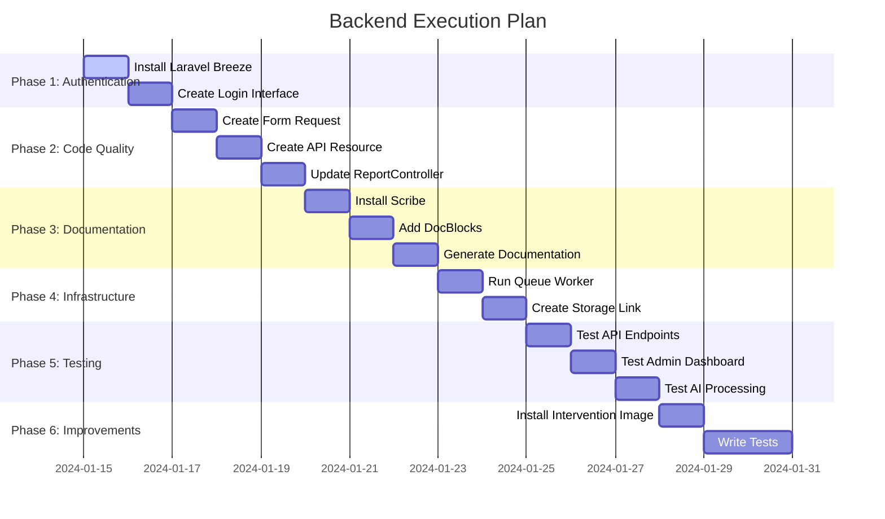

# Backend Execution Plan - Smart Damage Assessment System

## Overview

This execution plan covers the remaining tasks to complete the Laravel backend based on the original requirements and code standards in [`AGENTS.md`](../AGENTS.md).

---

## Current Project Status

### ✅ Completed Components

| Component                 | Status       | File                                                                                                                                                                                                                                                                                                                  |
| ------------------------- | ------------ | --------------------------------------------------------------------------------------------------------------------------------------------------------------------------------------------------------------------------------------------------------------------------------------------------------------------- |
| Database Migrations       | ✅ Done      | [`backend/database/migrations/2024_01_01_000001_create_users_and_reports_tables.php`](../backend/database/migrations/2024_01_01_000001_create_users_and_reports_tables.php)                                                                                                                                           |
| Models (User, Report)     | ✅ Done      | [`backend/app/Models/User.php`](../backend/app/Models/User.php), [`backend/app/Models/Report.php`](../backend/app/Models/Report.php)                                                                                                                                                                                  |
| API Controllers           | ✅ Done      | [`backend/app/Http/Controllers/Api/AuthController.php`](../backend/app/Http/Controllers/Api/AuthController.php), [`backend/app/Http/Controllers/Api/ReportController.php`](../backend/app/Http/Controllers/Api/ReportController.php)                                                                                  |
| Admin Controller          | ✅ Done      | [`backend/app/Http/Controllers/Admin/DashboardController.php`](../backend/app/Http/Controllers/Admin/DashboardController.php)                                                                                                                                                                                         |
| AI Job (AnalyzeDamageJob) | ✅ Done      | [`backend/app/Jobs/AnalyzeDamageJob.php`](../backend/app/Jobs/AnalyzeDamageJob.php)                                                                                                                                                                                                                                   |
| GeminiService             | ✅ Done      | [`backend/app/Services/GeminiService.php`](../backend/app/Services/GeminiService.php)                                                                                                                                                                                                                                 |
| API Routes                | ✅ Done      | [`backend/routes/api.php`](../backend/routes/api.php)                                                                                                                                                                                                                                                                 |
| Web Routes                | ✅ Done      | [`backend/routes/web.php`](../backend/routes/web.php), [`backend/routes/auth.php`](../backend/routes/auth.php)                                                                                                                                                                                                        |
| Admin Views               | ✅ Done      | [`backend/resources/views/admin/dashboard.blade.php`](../backend/resources/views/admin/dashboard.blade.php), [`backend/resources/views/admin/map.blade.php`](../backend/resources/views/admin/map.blade.php), [`backend/resources/views/admin/reports.blade.php`](../backend/resources/views/admin/reports.blade.php) |
| UserSeeder                | ✅ Done      | [`backend/database/seeders/UserSeeder.php`](../backend/database/seeders/UserSeeder.php)                                                                                                                                                                                                                               |
| Laravel Sanctum           | ✅ Installed | [`backend/composer.json`](../backend/composer.json:11)                                                                                                                                                                                                                                                                |
| Guzzle HTTP               | ✅ Installed | [`backend/composer.json`](../backend/composer.json:9)                                                                                                                                                                                                                                                                 |

### ❌ Not Yet Completed

| Component                  | Status            | Priority |
| -------------------------- | ----------------- | -------- |
| Laravel Breeze             | ❌ Not installed  | High     |
| Form Requests (Validation) | ❌ Not existing   | High     |
| API Resources              | ❌ Not existing   | High     |
| Scribe (API Documentation) | ❌ Not installed  | Medium   |
| Intervention Image         | ❌ Not installed  | Medium   |
| Tests (Feature/Unit)       | ❌ Not existing   | Medium   |
| Queue Worker Setup         | ❌ Not configured | High     |
| Storage Link               | ❌ Not configured | High     |

---

## Remaining Tasks

### Phase 1: Complete Authentication

#### Task 1.1: Install Laravel Breeze

**Goal:** Install Breeze for admin login interface as required in the original task.

**Commands:**

```bash
cd backend
composer require laravel/breeze --dev
php artisan breeze:install blade
npm install
npm run dev
```

**Affected Files:**

- [`backend/composer.json`](../backend/composer.json) - Add laravel/breeze
- [`backend/routes/auth.php`](../backend/routes/auth.php) - Will be replaced by Breeze routes
- [`backend/app/Http/Controllers/Auth/AuthController.php`](../backend/app/Http/Controllers/Auth/AuthController.php) - May be replaced

**Expected Result:**

- Ready-to-use login/register interfaces
- Route protection with middleware
- Password reset functionality

---

#### Task 1.2: Create Custom Login Interface (Optional)

**Goal:** If not using Breeze, create [`backend/resources/views/auth/login.blade.php`](../backend/resources/views/auth/login.blade.php).

**Steps:**

1. Create folder `backend/resources/views/auth/`
2. Create file `login.blade.php` with login form
3. Add CSS styling (Tailwind or Bootstrap)

**Expected Result:**

- Login interface working with [`AuthController.php`](../backend/app/Http/Controllers/Auth/AuthController.php)

---

### Phase 2: Improve Code Quality

#### Task 2.1: Create Form Request for Validation

**Goal:** Create [`backend/app/Http/Requests/StoreReportRequest.php`](../backend/app/Http/Requests/StoreReportRequest.php) to separate validation logic from Controller.

**Command:**

```bash
php artisan make:request StoreReportRequest
```

**File Content:**

```php
<?php

namespace App\Http\Requests;

use Illuminate\Foundation\Http\FormRequest;
use Illuminate\Contracts\Validation\Validator;
use Illuminate\Http\Exceptions\HttpResponseException;

class StoreReportRequest extends FormRequest
{
    public function authorize(): bool
    {
        return true;
    }

    public function rules(): array
    {
        return [
            'image' => 'required|image|max:10240',
            'latitude' => 'required|numeric|between:-90,90',
            'longitude' => 'required|numeric|between:-180,180',
            'raw_location' => 'required|string|max:255',
            'raw_description' => 'nullable|string|max:2000',
        ];
    }

    public function messages(): array
    {
        return [
            'image.required' => 'The image field is required.',
            'image.image' => 'The file must be an image.',
            'image.max' => 'The image may not be greater than 10MB.',
            'latitude.required' => 'The latitude field is required.',
            'latitude.numeric' => 'The latitude must be a number.',
            'latitude.between' => 'The latitude must be between -90 and 90.',
            'longitude.required' => 'The longitude field is required.',
            'longitude.numeric' => 'The longitude must be a number.',
            'longitude.between' => 'The longitude must be between -180 and 180.',
            'raw_location.required' => 'The location field is required.',
            'raw_location.max' => 'The location may not be greater than 255 characters.',
            'raw_description.max' => 'The description may not be greater than 2000 characters.',
        ];
    }

    protected function failedValidation(Validator $validator)
    {
        throw new HttpResponseException(
            response()->json([
                'errors' => $validator->errors()
            ], 422)
        );
    }
}
```

**Affected Files:**

- New: [`backend/app/Http/Requests/StoreReportRequest.php`](../backend/app/Http/Requests/StoreReportRequest.php)
- Will update: [`backend/app/Http/Controllers/Api/ReportController.php`](../backend/app/Http/Controllers/Api/ReportController.php)

---

#### Task 2.2: Create API Resource

**Goal:** Create [`backend/app/Http/Resources/ReportResource.php`](../backend/app/Http/Resources/ReportResource.php) to transform data to JSON consistently.

**Command:**

```bash
php artisan make:resource ReportResource
```

**File Content:**

```php
<?php

namespace App\Http\Resources;

use Illuminate\Http\Request;
use Illuminate\Http\Resources\Json\JsonResource;

class ReportResource extends JsonResource
{
    /**
     * Transform the resource into an array.
     *
     * @return array<string, mixed>
     */
    public function toArray(Request $request): array
    {
        return [
            'id' => $this->id,
            'user' => [
                'id' => $this->user->id,
                'name' => $this->user->name,
            ],
            'image_url' => url('storage/' . $this->image_path),
            'location' => [
                'raw' => $this->raw_location,
                'normalized' => $this->ai_location ?? $this->raw_location,
                'coordinates' => [
                    'latitude' => (float) $this->latitude,
                    'longitude' => (float) $this->longitude,
                ],
            ],
            'description' => [
                'raw' => $this->raw_description,
                'ai_analysis' => $this->ai_analysis,
            ],
            'damage_assessment' => [
                'level' => $this->ai_damage_level,
                'status' => $this->status,
            ],
            'created_at' => $this->created_at->format('Y-m-d H:i:s'),
            'updated_at' => $this->updated_at->format('Y-m-d H:i:s'),
        ];
    }
}
```

**Affected Files:**

- New: [`backend/app/Http/Resources/ReportResource.php`](../backend/app/Http/Resources/ReportResource.php)
- Will update: [`backend/app/Http/Controllers/Api/ReportController.php`](../backend/app/Http/Controllers/Api/ReportController.php)

---

#### Task 2.3: Update ReportController

**Goal:** Update [`backend/app/Http/Controllers/Api/ReportController.php`](../backend/app/Http/Controllers/Api/ReportController.php) to use Form Request and API Resource.

**Required Changes:**

1. Import `StoreReportRequest` and `ReportResource`
2. Update `store()` method to use `StoreReportRequest`
3. Update `index()` method to use `ReportResource::collection()`
4. Update `show()` method to use `ReportResource::make()`
5. Add DocBlocks for documentation

**Updated Code:**

```php
<?php

namespace App\Http\Controllers\Api;

use App\Http\Controllers\Controller;
use App\Http\Requests\StoreReportRequest;
use App\Http\Resources\ReportResource;
use App\Jobs\AnalyzeDamageJob;
use App\Models\Report;
use Illuminate\Http\Request;

/**
 * @group Report Management
 *
 * APIs for managing damage reports
 */
class ReportController extends Controller
{
    /**
     * Get all reports for the authenticated user.
     *
     * @authenticated
     * @response 200 {
     *   "data": [
     *     {
     *       "id": 1,
     *       "user": {"id": 1, "name": "User"},
     *       "image_url": "http://...",
     *       "location": {...},
     *       "description": {...},
     *       "damage_assessment": {...}
     *     }
     *   ]
     * }
     */
    public function index(): \Illuminate\Http\JsonResponse
    {
        $reports = auth()->user()->reports()->latest()->get();
        return response()->json(ReportResource::collection($reports));
    }

    /**
     * Create a new damage report.
     *
     * @authenticated
     * @bodyParam image file required The damage image. Maximum size: 10MB.
     * @bodyParam latitude number required The GPS latitude. Example: 36.2018
     * @bodyParam longitude number required The GPS longitude. Example: 37.1342
     * @bodyParam raw_location string required The location name as entered by user. Example: "حلب السكري"
     * @bodyParam raw_description string optional Additional description. Maximum: 2000 characters.
     * @response 201 {
     *   "data": {
     *     "id": 1,
     *     "status": "pending",
     *     "message": "Report submitted successfully. Processing will start shortly."
     *   }
     * }
     * @response 422 {
     *   "errors": {
     *     "image": ["The image field is required."]
     *   }
     * }
     */
    public function store(StoreReportRequest $request): \Illuminate\Http\JsonResponse
    {
        $imagePath = $request->file('image')->store('reports', 'public');

        $report = Report::create([
            'user_id' => auth()->id(),
            'image_path' => $imagePath,
            'latitude' => $request->latitude,
            'longitude' => $request->longitude,
            'raw_location' => $request->raw_location,
            'raw_description' => $request->raw_description ?? '',
            'status' => 'pending',
        ]);

        AnalyzeDamageJob::dispatch($report->id);

        return response()->json([
            'data' => [
                'id' => $report->id,
                'status' => 'pending',
                'message' => 'Report submitted successfully. Processing will start shortly.'
            ]
        ], 201);
    }

    /**
     * Get a specific report.
     *
     * @authenticated
     * @urlParam id required The report ID.
     * @response 200 {
     *   "data": {
     *     "id": 1,
     *     "user": {...},
     *     "image_url": "http://...",
     *     ...
     *   }
     * }
     * @response 404 {"message": "Report not found"}
     */
    public function show(int $id): \Illuminate\Http\JsonResponse
    {
        $report = auth()->user()->reports()->findOrFail($id);
        return response()->json(ReportResource::make($report));
    }
}
```

---

### Phase 3: API Documentation

#### Task 3.1: Install Scribe

**Goal:** Install Scribe package for automatic API documentation.

**Commands:**

```bash
cd backend
composer require --dev knuckleswtf/scribe
php artisan vendor:publish --tag=scribe-config
```

**Affected Files:**

- [`backend/composer.json`](../backend/composer.json) - Add knuckleswtf/scribe
- New: `backend/config/scribe.php`

---

#### Task 3.2: Add DocBlocks

**Goal:** Add DocBlocks to all Controller methods to appear in documentation.

**Files to Update:**

- [`backend/app/Http/Controllers/Api/AuthController.php`](../backend/app/Http/Controllers/Api/AuthController.php)
- [`backend/app/Http/Controllers/Api/ReportController.php`](../backend/app/Http/Controllers/Api/ReportController.php)

**Example DocBlock:**

```php
/**
 * @group Authentication
 *
 * APIs for user authentication
 */
class AuthController extends Controller
{
    /**
     * Login user and return API token.
     *
     * @bodyParam email string required The user email. Example: admin@test.com
     * @bodyParam password string required The user password. Example: password
     * @response 200 {
     *   "token": "1|xyz...",
     *   "user": {
     *     "id": 1,
     *     "name": "Admin User",
     *     "email": "admin@test.com",
     *     "role": "admin"
     *   }
     * }
     * @response 401 {"error": "Invalid credentials"}
     */
    public function login(Request $request) { ... }
```

---

#### Task 3.3: Generate Documentation

**Goal:** Generate HTML documentation page.

**Command:**

```bash
php artisan scribe:generate
```

**Result:**

- Documentation files in `backend/public/docs/`
- Access via: `http://localhost:8000/docs`

---

### Phase 4: Infrastructure Setup

#### Task 4.1: Run Queue Worker

**Goal:** Run Queue Worker for background job processing.

**Command (for development):**

```bash
# In a separate terminal
cd backend
php artisan queue:work
```

**Or use Supervisor for production:**

```ini
[program:laravel-queue-worker]
process_name=%(program_name)s_%(process_num)02d
command=php /var/www/html/backend/artisan queue:work --sleep=3 --tries=3
autostart=true
autorestart=true
user=www-data
numprocs=2
redirect_stderr=true
stdout_logfile=/var/www/html/backend/storage/logs/queue-worker.log
```

---

#### Task 4.2: Create Storage Link

**Goal:** Create symbolic link to access stored images.

**Command:**

```bash
cd backend
php artisan storage:link
```

**Result:**

- Symbolic link from `backend/public/storage` to `backend/storage/app/public`
- Access images via: `http://localhost:8000/storage/reports/image.jpg`

---

### Phase 5: Testing

#### Task 5.1: Test API Endpoints

**Goal:** Test all endpoints using Postman or curl.

**Required Tests:**

1. **Login:**

```bash
curl -X POST http://localhost:8000/api/login \
  -H "Content-Type: application/json" \
  -d '{"email":"admin@test.com","password":"password"}'
```

2. **Upload Report:**

```bash
curl -X POST http://localhost:8000/api/reports \
  -H "Authorization: Bearer YOUR_TOKEN" \
  -F "image=@/path/to/image.jpg" \
  -F "latitude=36.2018" \
  -F "longitude=37.1342" \
  -F "raw_location=حلب السكري" \
  -F "raw_description=تضرر المبنى بشكل جزئي"
```

3. **Get Reports:**

```bash
curl -X GET http://localhost:8000/api/reports \
  -H "Authorization: Bearer YOUR_TOKEN"
```

4. **Get Specific Report:**

```bash
curl -X GET http://localhost:8000/api/reports/1 \
  -H "Authorization: Bearer YOUR_TOKEN"
```

---

#### Task 5.2: Test Admin Dashboard

**Goal:** Test all admin dashboard pages.

**Required Tests:**

1. Login as Admin
2. View Dashboard
3. View Map
4. View Reports Table
5. Verify Chart.js functionality

---

#### Task 5.3: Test AI Processing

**Goal:** Ensure Jobs work correctly.

**Required Tests:**

1. Upload a new report
2. Verify status change: pending → processing → completed
3. Verify AI data exists (ai_location, ai_damage_level, ai_analysis)
4. Check Logs in `backend/storage/logs/laravel.log`

---

### Phase 6: Optional Improvements

#### Task 6.1: Install Intervention Image

**Goal:** Compress images before upload to save space.

**Command:**

```bash
cd backend
composer require intervention/image
```

**Usage in ReportController:**

```php
use Intervention\Image\Facades\Image;

$image = Image::make($request->file('image'));
$image->resize(1920, null, function ($constraint) {
    $constraint->aspectRatio();
    $constraint->upsize();
});
$imagePath = $request->file('image')->store('reports', 'public');
```

---

#### Task 6.2: Write Tests

**Goal:** Write Feature and Unit Tests.

**Commands:**

```bash
php artisan make:test ReportApiTest
php artisan make:test AuthApiTest
php artisan make:test AnalyzeDamageJobTest
```

---

## Timeline



---

## Task Summary

| #   | Task                       | Priority | Estimated Duration | Files                                                                                                                                                                                                                                |
| --- | -------------------------- | -------- | ------------------ | ------------------------------------------------------------------------------------------------------------------------------------------------------------------------------------------------------------------------------------ |
| 1   | Install Laravel Breeze     | High     | 1 day              | [`backend/composer.json`](../backend/composer.json)                                                                                                                                                                                  |
| 2   | Create Form Request        | High     | 1 day              | [`backend/app/Http/Requests/StoreReportRequest.php`](../backend/app/Http/Requests/StoreReportRequest.php)                                                                                                                            |
| 3   | Create API Resource        | High     | 1 day              | [`backend/app/Http/Resources/ReportResource.php`](../backend/app/Http/Resources/ReportResource.php)                                                                                                                                  |
| 4   | Update ReportController    | High     | 1 day              | [`backend/app/Http/Controllers/Api/ReportController.php`](../backend/app/Http/Controllers/Api/ReportController.php)                                                                                                                  |
| 5   | Install Scribe             | Medium   | 1 day              | [`backend/composer.json`](../backend/composer.json)                                                                                                                                                                                  |
| 6   | Add DocBlocks              | Medium   | 1 day              | [`backend/app/Http/Controllers/Api/AuthController.php`](../backend/app/Http/Controllers/Api/AuthController.php), [`backend/app/Http/Controllers/Api/ReportController.php`](../backend/app/Http/Controllers/Api/ReportController.php) |
| 7   | Run Queue Worker           | High     | 1 day              | -                                                                                                                                                                                                                                    |
| 8   | Create Storage Link        | High     | 1 day              | -                                                                                                                                                                                                                                    |
| 9   | Test System                | High     | 3 days             | -                                                                                                                                                                                                                                    |
| 10  | Install Intervention Image | Low      | 1 day              | [`backend/composer.json`](../backend/composer.json)                                                                                                                                                                                  |
| 11  | Write Tests                | Medium   | 2 days             | [`backend/tests/Feature/`](../backend/tests/Feature/), [`backend/tests/Unit/`](../backend/tests/Unit/)                                                                                                                               |

---

## Prerequisites

Before starting, ensure:

1. ✅ Laravel 11 installed
2. ✅ MySQL database configured
3. ✅ Google Gemini API Key available
4. ✅ Node.js and npm installed (for Breeze)

---

## Quick Start Steps

```bash
# 1. Navigate to backend folder
cd backend

# 2. Install dependencies
composer install
npm install

# 3. Setup environment
cp .env.example .env
php artisan key:generate

# 4. Run migrations
php artisan migrate:fresh --seed

# 5. Create storage link
php artisan storage:link

# 6. Run Queue Worker (in separate terminal)
php artisan queue:work

# 7. Start server
php artisan serve
```

---

## Important Notes

1. **Queue Worker:** Must always be running to process AI Jobs
2. **Storage Link:** Required to access uploaded images
3. **Gemini API Key:** Add to `.env` as `GEMINI_API_KEY=your_key_here`
4. **Breeze:** If installed, will replace custom [`AuthController.php`](../backend/app/Http/Controllers/Auth/AuthController.php)
5. **Scribe:** Works only in development environment (local) by default

---

## References

- [`AGENTS.md`](../AGENTS.md) - Code standards
- [`README.md`](../README.md) - Project overview
- [`Documentation.md`](../Documentation.md) - Documentation tasks
- [`backend/LARAVEL_BACKEND_SUMMARY.md`](../backend/LARAVEL_BACKEND_SUMMARY.md) - Backend summary
- [`backend/SETUP.md`](../backend/SETUP.md) - Setup instructions
