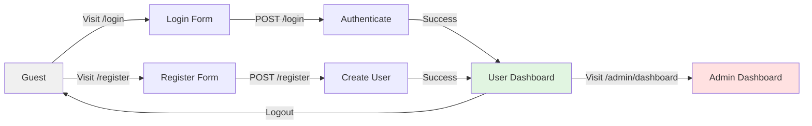
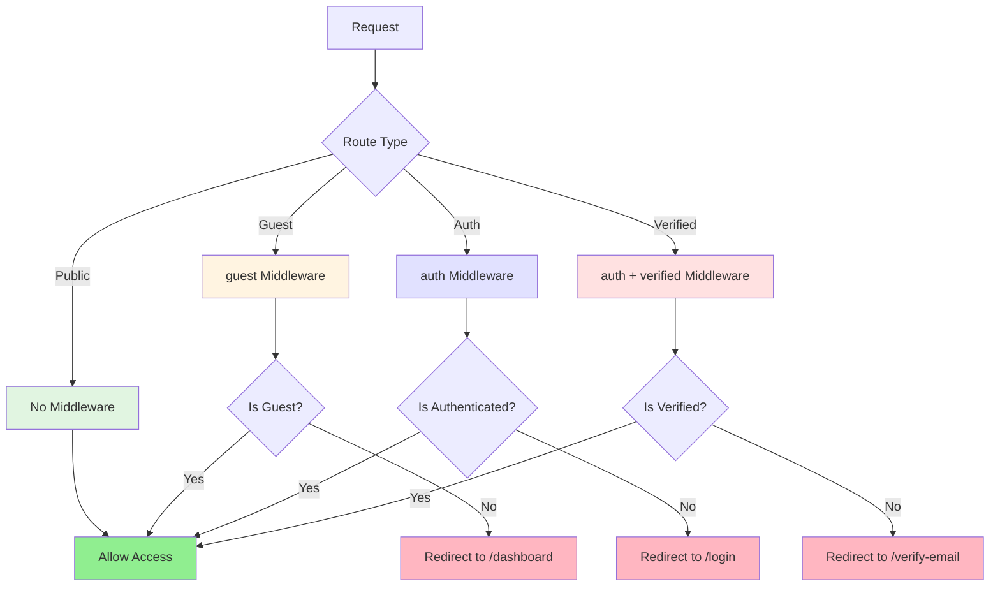
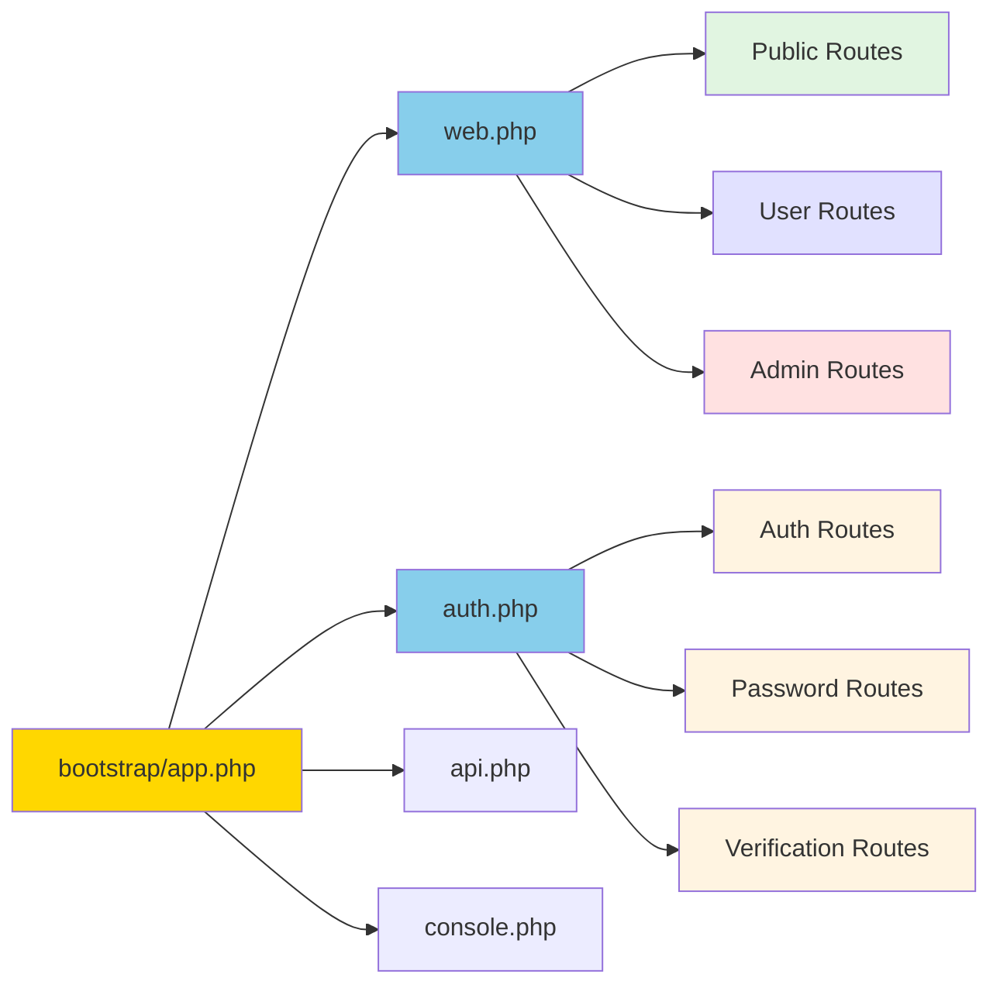

# Web Routes Architecture Diagram

## Route Structure Overview

```mermaid
graph TD
    A[Web Routes] --> B[Public Routes]
    A --> C[Auth Routes]
    A --> D[User Routes]
    A --> E[Admin Routes]

    B --> B1[/]
    B --> B2[/login]
    B --> B3[/register]
    B --> B4[/forgot-password]
    B --> B5[/reset-password]

    C --> C1[/verify-email]
    C --> C2[/email/verification-notification]
    C --> C3[/confirm-password]
    C --> C4[/password]
    C --> C5[/logout]

    D --> D1[/dashboard]
    D --> D2[/profile]

    E --> E1[/admin/dashboard]
    E --> E2[/admin/map]
    E --> E3[/admin/reports]

    style B fill:#e1f5e1
    style C fill:#fff4e1
    style D fill:#e1e1ff
    style E fill:#ffe1e1
```

## Authentication Flow



## Middleware Protection



## Route File Organization



## View-Controller Mapping

```mermaid
graph TD
    A[/] --> B[welcome.blade.php]
    A1[/login] --> C[login.blade.php]
    A2[/register] --> D[register.blade.php]
    A3[/dashboard] --> E[dashboard.blade.php]
    A4[/profile] --> F[profile/edit.blade.php]
    A5[/admin/dashboard] --> G[admin/dashboard.blade.php]
    A6[/admin/map] --> H[admin/map.blade.php]
    A7[/admin/reports] --> I[admin/reports.blade.php]

    C --> J[AuthenticatedSessionController]
    D --> K[RegisteredUserController]
    E --> L[Dashboard Function]
    F --> M[ProfileController]
    G --> N[Admin DashboardController]
    H --> N
    I --> N

    style B fill:#e1f5e1
    style C fill:#fff4e1
    style D fill:#fff4e1
    style E fill:#e1e1ff
    style F fill:#e1e1ff
    style G fill:#ffe1e1
    style H fill:#ffe1e1
    style I fill:#ffe1e1
```

## Implementation Priority

### Phase 1: Critical (Must Complete)

1. Load auth.php in bootstrap/app.php
2. Update web.php with admin routes
3. Create welcome.blade.php

### Phase 2: Important (Should Complete)

4. Verify all route names
5. Test route accessibility
6. Ensure middleware protection

### Phase 3: Enhancement (Nice to Have)

7. Add role-based middleware
8. Create route tests
9. Add route documentation to API docs
